# Prompt Files per Nyktifaes

Questa cartella contiene i **prompt file** riutilizzabili per assistere nel completamento del romanzo Nyktifaes.

## Cosa sono i Prompt File?

I prompt file sono template predefiniti che puoi invocare in GitHub Copilot Chat usando la sintassi `#prompt:nome-file`.

## Prompt Disponibili

### 📖 `#prompt:analizza-stile`

**Scopo**: Estrarre le caratteristiche stilistiche dal testo originale.

**Quando usarlo**: 
- All'inizio del progetto
- Prima di scrivere nuovi capitoli
- Quando serve un riferimento stilistico

**Output**: File `stile_nyktifaes.md`

**Esempio d'uso**:
```
#prompt:analizza-stile #file:original/Nyktifaes.pdf
```

---

### 📅 `#prompt:estrai-timeline`

**Scopo**: Creare una timeline grezza degli eventi dagli appunti dell'autore.

**Quando usarlo**:
- Dopo aver convertito gli appunti in formato leggibile
- Per creare la base di `timeline_originale.md`

**Output**: File `timeline_originale.md`

**Esempio d'uso**:
```
#prompt:estrai-timeline #file:appunti_grezzi.txt
```

---

### 👥 `#prompt:mappa-personaggi`

**Scopo**: Creare schede dettagliate per tutti i personaggi dell'opera.

**Quando usarlo**:
- Dopo aver letto il testo originale
- Prima di sviluppare archi narrativi
- Per verificare relazioni tra personaggi

**Output**: File `personaggi.md`

**Esempio d'uso**:
```
#prompt:mappa-personaggi #file:original/Nyktifaes.pdf #file:appunti_personaggi.txt
```

---

### ✅ `#prompt:verifica-coerenza`

**Scopo**: Verificare che un contenuto narrativo proposto sia coerente con l'opera esistente.

**Quando usarlo**:
- Prima di approvare un nuovo capitolo
- Dopo aver scritto una bozza
- Per controllare modifiche a contenuti esistenti

**Output**: Report di verifica

**Esempio d'uso**:
```
#prompt:verifica-coerenza #file:capitoli/cap_15/testo.md #file:stile_nyktifaes.md #file:timeline_estesa.md #file:personaggi.md
```

---

## Come Usare i Prompt File

### Sintassi Base

```
#prompt:nome-file
```

### Con File di Contesto

```
#prompt:nome-file #file:percorso/file1.md #file:percorso/file2.md
```

### Con Agente Personalizzato

Se stai usando l'agente **Nyktifaes Guardian**, l'agente applicherà automaticamente i vincoli e le regole del progetto quando usi questi prompt.

## Workflow Consigliato

```mermaid
graph TD
    A[Inizio Progetto] --> B[#prompt:analizza-stile]
    B --> C[#prompt:estrai-timeline]
    C --> D[#prompt:mappa-personaggi]
    D --> E[Scrivi Bozza Capitolo]
    E --> F[#prompt:verifica-coerenza]
    F --> G{Coerente?}
    G -->|Sì| H[Approva Capitolo]
    G -->|No| I[Correggi]
    I --> F
    H --> J[Prossimo Capitolo]
    J --> E
```



## Best Practices

### 1. Prepara il Contesto

Prima di invocare un prompt, assicurati di avere:
- File necessari allegati con `#file:`
- Contesto chiaro di cosa stai cercando
- Agente appropriato selezionato

### 2. Combina i Prompt

Puoi usare più prompt in sequenza:

```
1. #prompt:analizza-stile #file:cap_01.md
2. [Rivedi output]
3. #prompt:verifica-coerenza #file:cap_nuova_bozza.md
```

### 3. Personalizza le Istruzioni

I prompt file sono template. Puoi aggiungere istruzioni specifiche:

```
#prompt:mappa-personaggi #file:testo.pdf

Concentrati in particolare sui personaggi secondari che appaiono 
nel capitolo 10-15, voglio verificare la loro coerenza.
```

### 4. Salva gli Output

Quando un prompt genera un file (es. `stile_nyktifaes.md`), salvalo nella root del progetto per riferimenti futuri.

## Creare Nuovi Prompt File

Vuoi creare un nuovo prompt? Segui questo template:

```markdown
# [Titolo del Prompt]

[Breve descrizione dello scopo]

## Obiettivo

[Spiegazione dettagliata di cosa deve fare questo prompt]

## Istruzioni

1. [Passo 1]
2. [Passo 2]
3. [...]

## Output

[Descrizione del formato di output atteso]

## Nota Importante

[Eventuali avvertenze o considerazioni speciali]
```

Salvalo come `.prompt.md` in questa cartella.

## Troubleshooting

### Il prompt non viene riconosciuto

- Verifica che il file abbia estensione `.prompt.md`
- Verifica che sia nella cartella `.github/prompts/`
- Riavvia VS Code se necessario

### L'output non è quello atteso

- Controlla di aver allegato tutti i file necessari
- Verifica di essere nell'agente corretto (Nyktifaes Guardian)
- Aggiungi più contesto nella chat

### Il prompt genera contenuto non fedele

- Assicurati di usare l'agente **Nyktifaes Guardian**
- Verifica che i file di stile e riferimento siano aggiornati
- Rivedi e correggi manualmente se necessario

---

## Prossimi Sviluppi

Prompt file pianificati per il futuro:

- `scrivi-capitolo.prompt.md` - Template strutturato per nuovi capitoli
- `riassunto-capitolo.prompt.md` - Generazione riassunti standardizzati
- `confronta-stile.prompt.md` - Confronto tra stile originale e nuovo contenuto
- `espandi-dialogo.prompt.md` - Espansione dialoghi in stile coerente

---

**Ricorda**: I prompt file sono strumenti, non sostituiscono il giudizio umano. Rivedi sempre l'output e valuta se è fedele alla voce originale dell'opera.

